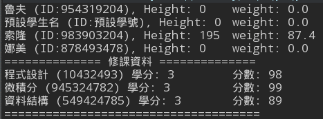
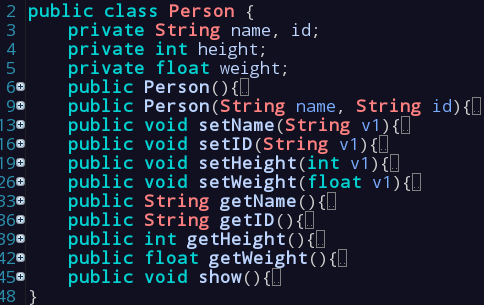

# week03-dg-20170320

#### 課堂練習題目:  
##EX1:
請設計一個程式包含主程式, `Person`, `Student`, `Teacher` 與 `Staff` Class
1. `Student`, `Teacher` 與`Staff` 是繼承自 `Person` 類別
2. `Person`的主要資料成員要有 `name, id, height, weight, gender, address, email, phone`
3. `Student`的主要資料成員有 修課 資訊
4. `Student` 建構出來的物件要可以加入課程資料, 也要能列出`student物件`的修課資訊
5. `Teacher` 有 學位, 研究領域, web-address 等資料成員, 請製作可以設定及取得 各資料成員資料的函式(函式要具有過濾非正常輸入資料的功能 )
6. 請設計一個介面讓使用者可以分別建立這三種身份的物件，請用 `ArrayList` 進行管理

----
#### 作業:
在現實生活中存在各式各樣的車輛，汽車、機車、卡車…等。請各位車輛為例完成下列要求:
1. 請分析汽車、機車及卡車三個類別中的共通點以建立`Vehicle`類別
2. 分別建立汽車、機車及卡車的類別並都是繼承自`Vehicle`類別
3. 各類別都必須依該車輛種類建立相關 method 
4. 汽車、機車及卡車每一種類別都分別建立多個物件，並用`ArrayList`進行管理，同時必須要能達到查詢特定物件的功能。
