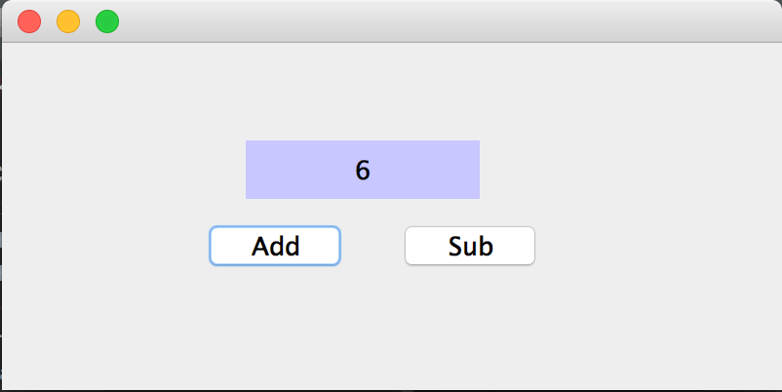
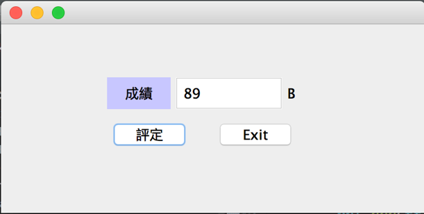
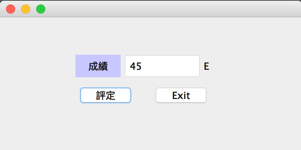

# week06-dg-20170424

#### 課堂練習題目:  

1. 請寫一個程式可以讓使用者點擊 Add 數字加1, 點擊 sub 數字減 1

---

#### 作業:

1. 請寫一個程式讓使用者輸入分數後點擊評定可輸出等地 

| 分數    | 成績  |
| ------- |:------:|
| 90~100  | A |
| 80~89   | B |
| 70~79  | C |
| 60~69  | D |
| <60  | E |

2. 若使用者輸入有小數請先做 四捨五入

