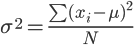

# week07-20161114

#### 課堂練習題目:  

1. 請寫一個程式，用陣列儲存使用者輸入的 n 個整數，透過函式 var() 可以回傳計算該陣列裡的數字的變異數後再列印出結果。
	
	
	
2. 承上題，除了var() 函數之外，再用建立一個 std() 函數，程式在接收完使用者輸入的一維整數陣列之後，呼叫std()函式可得到陣列的標準差，特別注意，不要只用 std() 函數算結果，必須由std()去呼叫 var() 函數之後回到 std() 函式處理完再傳回給主程式，主程式再把結果印出。
3. 請寫一個程式，讓使用者輸入一個整數二維陣列，建立 var2()函式 及std2()可以分別計算二維陣列的變異數與標準差，並把結果回傳到主程式印出。
4. 讓使用者輸入一個正整數 n，接著使用遞迴呼叫印出 n! 的結果。

#### 作業:
1. 請寫一函數 lcm(x,y,z)，求三數 x、y、z 之最小公倍數
2. 以遞迴設計函數，輸入一個正整數值(不含 0)，傳回該數值是幾位數(# ofdigits)。
3. 輸入兩個整數，使用遞迴函數呼叫輸出 C(m,n)。
	
	
	
4. 寫一遞迴函數，求 m、n 兩數的最大公因數 gcd(m,n)由鍵盤輸入
5. 寫一遞迴函數，讓使用者輸入一個長整數，透過遞迴函數運算後得到反向的數字字串並印出。例如:輸入 1234 回傳 4321
