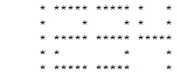

# week08-20161127

#### 課堂練習題目:  

1. 請寫一個函式 (不是遞迴) 進行十進制數字轉換成二進制數字，例如十進制的 13 會輸出二進制的 1101
2. 將前一題加強成可以做10以下的各種數字系統轉換
3. 寫一程式計算兩個矩陣的乘法，例如 A 是 n1 x m1 的矩陣， B 是 n2 x m2 的矩 陣，C=AB 為 n1 x m2 矩陣
 - 第一列輸入 n1, m1, n2 及 m2 等 4 個整數
 - n1, m1 是第一個陣列的列(row)與行 (column)，而 n2, m2 則是第二個陣列的列(row)與行(column)，其中 m2 = n2。
 - 接著輸 入兩個陣列的內容
4. 請用類別撰寫一個計算機，透過計算機物件可以計算 加、減、乘、除、平方、立方、開根號的功能

#### 作業:
1. 請寫一個 遞迴函式)進行十進制數字轉換成二進制數字，例如十進制的 13 會輸出二進制的 1101
2. 將前一題加強成可以做10以下的各種數字系統轉換 (必須使用遞迴)
3. 請寫一個遞迴程式，輸入一個 int 型態的資料，並回傳該資料在二進制下有多少個位元是 1，例如: 輸入 13 得到結果為 3
4. 請寫以類別方式寫一個程式可顯示四位數字的 LED 燈一組，可根據輸入的四位數字顯示數字。

  比如說， 由鍵盤輸入 1234 ，則可在螢幕上顯示:

	
  
  
