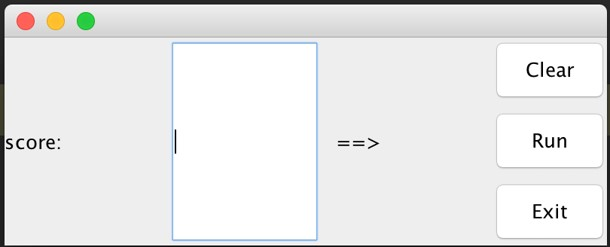
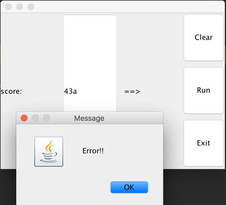
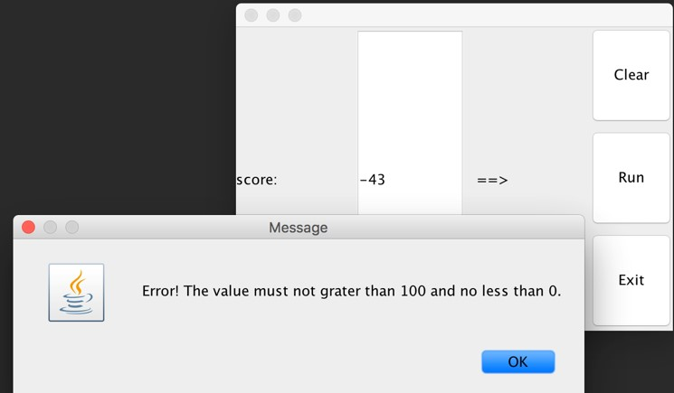
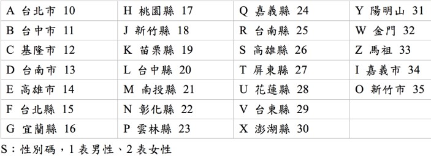
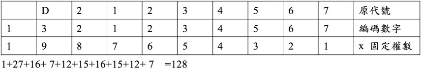

# week08-dg-20170508

#### 課堂練習題目:  
1. 請同學設計一個 分數轉等地的程式

- 當使用者輸入文字或多個小數點時會顯示格式錯誤

- 當使用者輸入值是超過 100 或 小於 0 時也要顯示錯誤訊息

---

#### 作業:
1.請同學設計一個Swing視窗版「身份證字號檢查器」
- 請用 10 個  JTextFIeld接收使用者輸入身證字號 的英文與數字，每一個 JTextField 必須要判斷格式是否符號，格式全符號再進行身份證字號的驗證看是否正確
- 格式驗證請用 Exception 進行處理
- 身分證字號共有十個碼(XS1234567C)，且有一定的編碼規則，其檢查編碼的規則如下：
- X：地區碼，範圍A-Z，所代表縣市，和其編碼數字如下：

- 1234567：流水編號7碼
- C：檢查碼，欄位1-9乘上加權數之總和，除以10之餘數，以10減之，即檢查碼。
- 其和為128，取個位數8，以10減之，為2，即檢查碼為2。
- 故完整身份證代號應該為 D212345672

