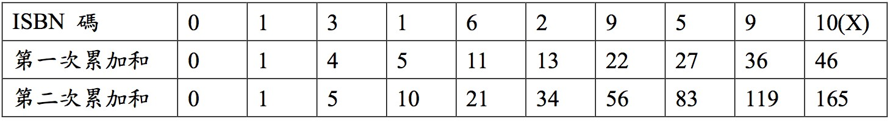
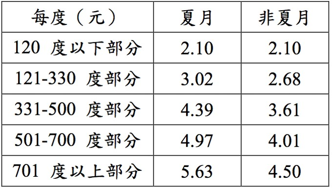
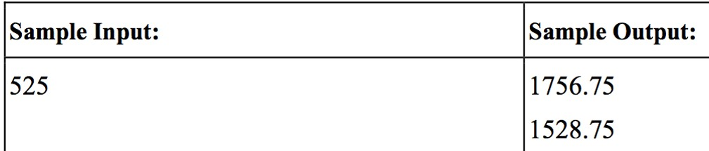
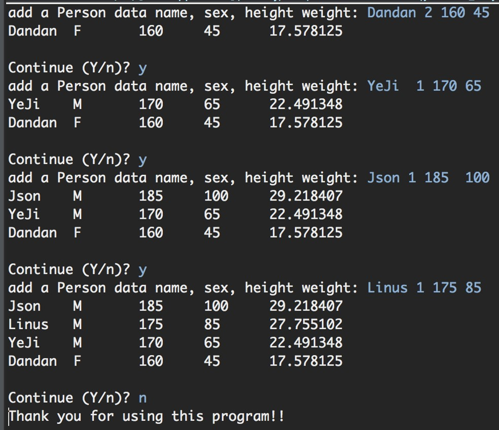
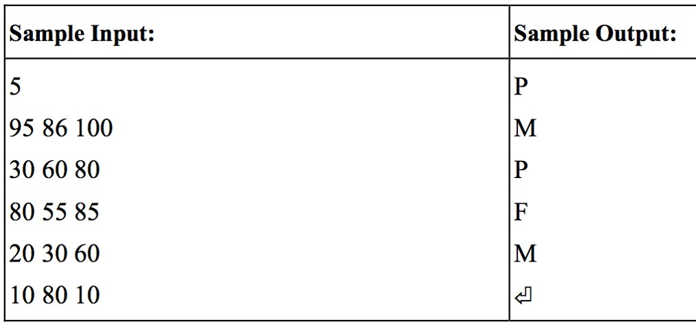
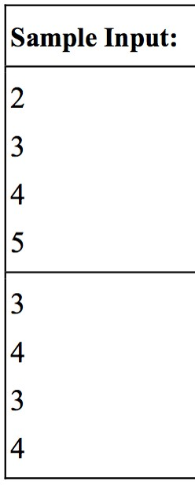
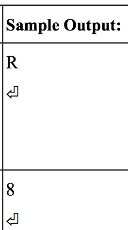
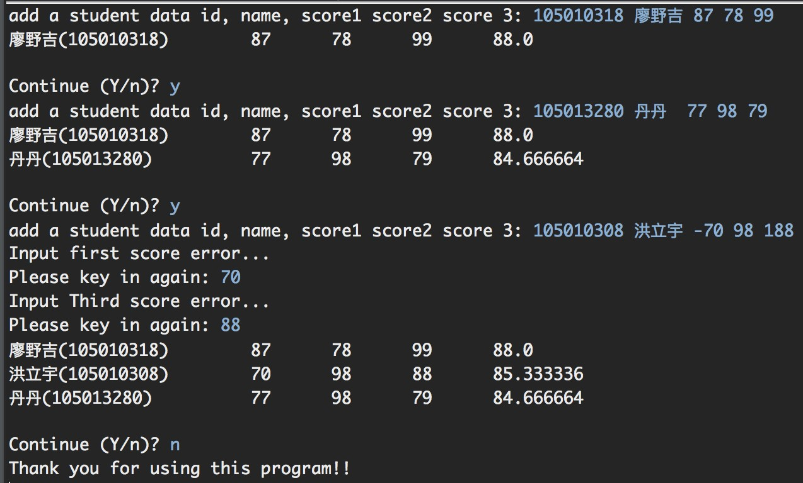

# week10-20161205

#### 課堂練習題目:  

1. ISBN(International Standard Book Number) 是一種世界共通的書籍編碼方法，世界上任 何一本書籍之出版，皆有著唯一的一組 ISBN 碼。此碼由十個位數組成，每一位數可 以為 0~9 的任何一個數字，或者為 X ，代表此位數為 10 。

 其判斷方法如下，首先，將此 ISBN 碼的十個位數分開，自左而右依次為第一位數，第二位數至第十位數，接著進行第一次的累加，使得第二位數成為第一位數到第二位數的和，第三位數為第一 位數到第三位數的累加和，第十位數為第一位數到第十位數的累加和;進行完第一次的累加和後，接著再依照相同之方法進行第二次的累加動作，我們稱此時最後所求得 之累加和為此 ISBN 碼之識別碼，倘若此識別碼為 11 的倍數，則此 ISBN 碼為合法的。

 例如，若輸入之 ISBN 碼為 0 1 3 1 6 2 9 5 9 X ，則經由計算可得其識別碼為 165 ，乃是 11 之倍數，故此為一合法之 ISBN 碼。輸入一串 ISBN 碼，以空格隔開。
 

2. 輸入所使用的度數，換算夏月及非夏月之電費金額:
 
 
 輸入輸出範例如下:
 
 
3. 請設計 Person 類別 (姓名, 性別, 身高, 體重)，使用者可以新增個人資料，每新增一筆就會列出目前的資料串有哪些人，而這些資料請用插入排序法依每一個人的 BMI 值由大到小排序。
 

#### 作業:
1. 某間學校舉辦英文檢定測驗，若是學生通過該測驗，則能通過畢業門檻。老師準備的英文測驗中分為三個項目當作考試，分別是聽力、閱讀、口說。
 每一個項目測驗滿分皆為 100 分，總分為 300 分。想要通過測驗有兩種方式。
 - 方式一:若是三個項目分數皆為 60 分以上 ( 包含 60 分 ) 即為通過測驗。
 - 方式二:若三個項目中有其中一個項目分數未滿 60 分，但三個項目分數總合超過 220 分，也可算通過測驗。
 
   (若三個項目中有其中一個項目分數未滿 60 分，而三個項目分數總合也沒能超過 220 分，可獲得補考機會。
   若是三個項目中有兩個項目不及格，但另一個項目成績高於 80 分 ( 包含 80 分 ) ，也可獲得補考的機會。)
 - 其餘皆判定為無法通過測驗。
 
 說明: 第一行為一個整數 N ，代表共有 N 組測試資料。之後有 N 行，每一行有 3 個非負整數 ( 範圍皆為 0 到 100), 分別代表該名學生聽力、閱讀、口說的測驗分數。若是通過測驗，則輸出 ”P” 。若是需要補考，則輸出 ”M” 。若是無法通過測驗， 則輸出 ”F” 
 

2. 輸有一種坊間常見的遊戲稱為 "18 啦 "~ 玩法介紹 : 由四個骰子來擲，只要其中任兩個是相同點，才開始計算點數，點數即為另兩個點數相加，若另兩個也一樣，則取較 大的一組相加，另外有下列幾種特殊情況:
 - 擲出 4 顆骰子點數均相同，稱為通殺 !
 - 任三顆點數相同或四顆點數均不相同，即為無意義 ! 請寫一程式，各別輸入四顆骰子點數，判斷結果 !
   

3. 設計一個 Student 的類別(學號, 姓名, 英文成績, 數學成績, 國文成績)，使用者可以連續輸入多筆同學資料，程式需滿足下列要求:
 - 成績輸入必須檢查是否在 0~100之間，如果錯誤要請使用者重新輸入
 - 加入資料後要顯示目前有哪些人在資料串裡
 - 資料串的資料須使用`插入排序法`依每同學的平均分數由大到小排序
  
