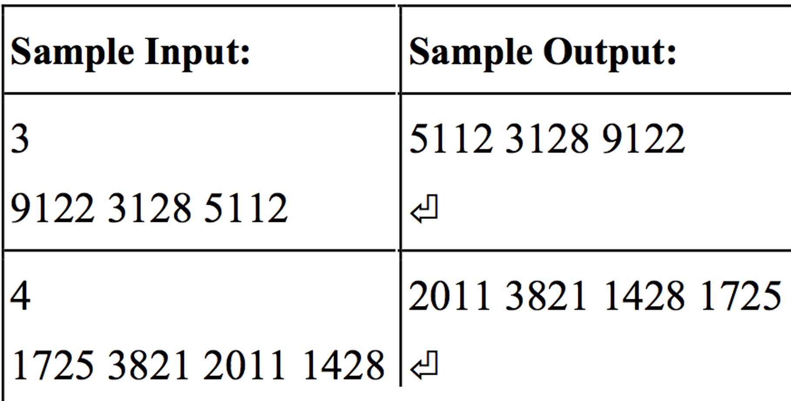
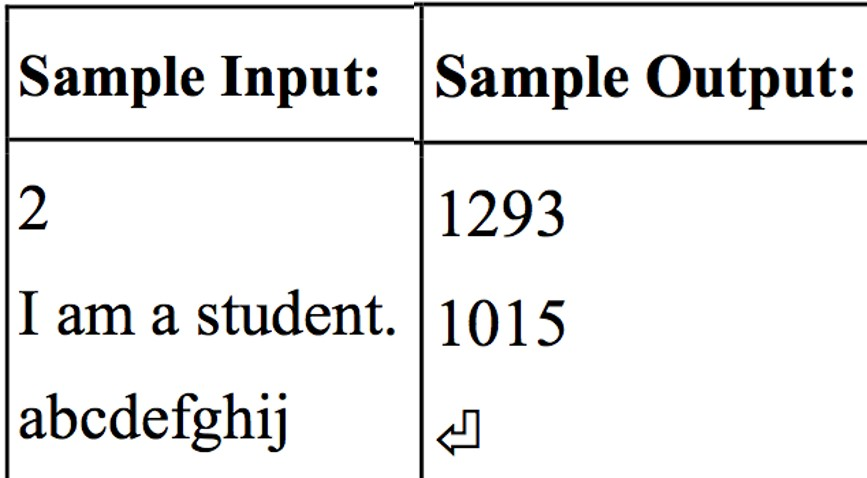
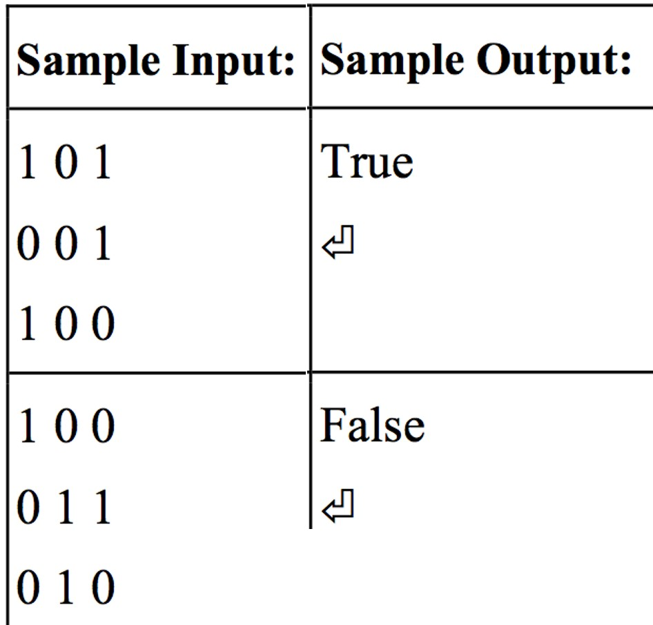
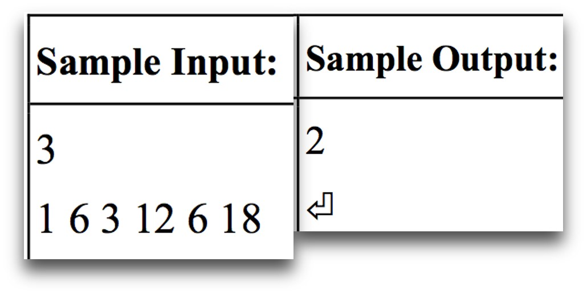
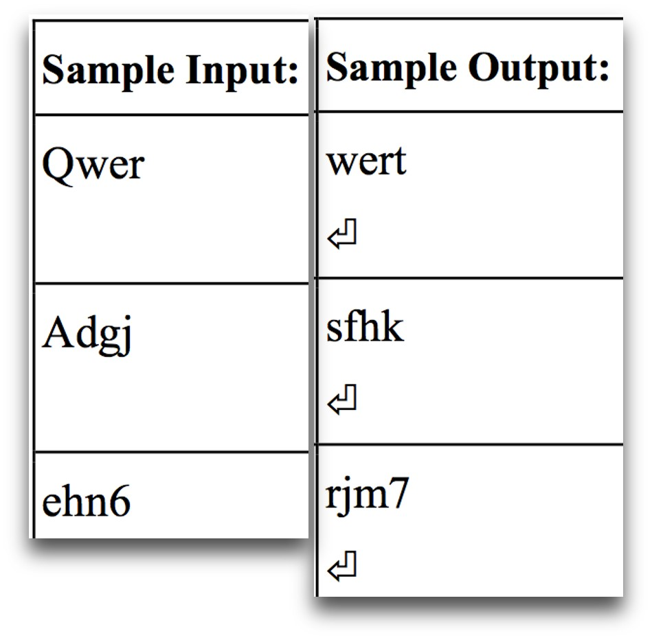
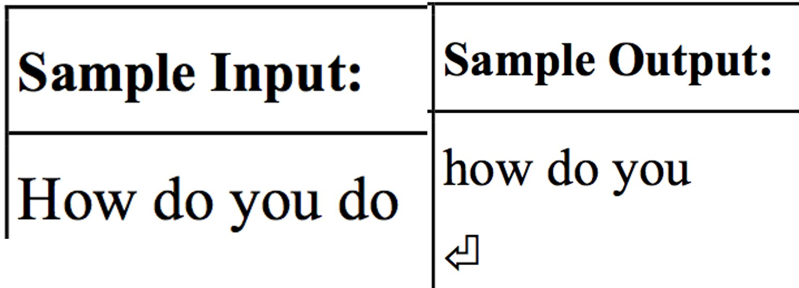

# week12-20161226
#### 課堂練習題目:  

1. 輸入一整數 N 及 N 個整數，請依照十進位中各位數字和由小到大排序輸出。如果各位數字和相等則比較數值由小到大排列。
例如: 9122 的各位數字和為 9+1+2+2=14、3128 的各位數字和為 3+1+2+8=14 而 5112 的各位數字和為 5+1+1+2=9。所以輸入 9122 3128 5112 需輸出 5112 3128 9122 ，這是因為 5112(9) < 3128(14) < 9122(14)，其中又因為 3128 與 9122 兩者的各位數字和都是 14，所以將 數值小的 3128 放前面。

 
 
2. 給定一字串，請將此字串中，每個字元的 ASCII 編碼數值進行加總，輸出其編碼數 值總和。舉例來說，若輸入之字串為 “abcdefghij” 共 10 個字元，其 ASCII 編碼依序為 “97 98 99 100 101 102 103 104 105 106” ，則編碼總和輸出為 1015 。

 

3. OX 遊戲是大家小時候的童年記憶，甚至在長大後，無聊時還是會玩一下呢 ! 但當 你一個人時，是否也能讓電腦跟你玩呢 ?

 

#### 作業:
1. 某遊覽車派遣公司共收到 n 筆任務訂單，訂單中詳細記載發車時間 s 和返回時間 d。 每一輛遊覽車只要任務時間不衝突，可立即更換司機繼續上路執行任務。請問該公司 至少需要調遣多少車輛才足以應付需求?

 

2. 輸入一段文字 ( 限制為 ASCII 表中，編號 32 至 125 之字元 ) ，將它們每個字元 依照鍵盤的位置，印出它們右邊的字元，若右邊按鍵有兩層字元 ( 如 : 和 ; 位於同 一按鍵上 ) ，則輸出下層字元，即 ”;” ，若該按鍵為上層字元 ( 如 !) 則輸出其右 邊按鍵之上層字元 ( 如 @) ，若輸入的字元右邊的鍵為不可視按鍵，如 shift, enter,backspace 或右邊已無按鍵，如不做更動，照樣輸出。

 

3. 斷詞在自然語言的研究上是個很重要的步驟，主要就是將關鍵字從句子中斷出，英文的斷詞較為簡單，就根據句子中的空格將英文字隔開。將輸入的句子進行斷詞，將斷出的關鍵字依照句子中的出現排序列印出。全部轉成小 寫，列印出的關鍵字不得重複，關鍵字間以一個空格隔開，最後一個關鍵字後面進行 換行。
例如輸入 How do you do ，則輸出 how do you

  
